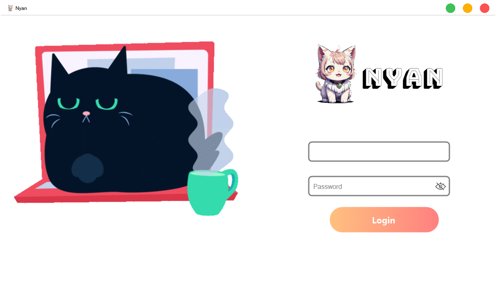
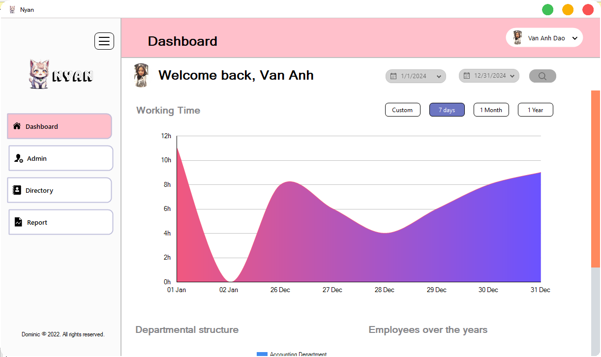
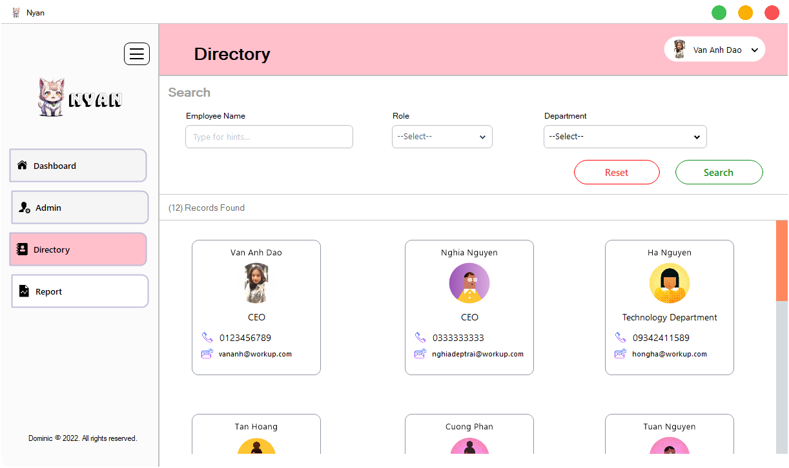

# 🚀 HRM

# Table of Contents

- [Overview](#Overview)
- [Install](#install)
  - [Requiement](.Requiement)
  - [Clone Project](.clone)
- [How to use?](#Htu)
- [Dependence](#dep)
- [Support Me](#support)

<div id="Overview"/>

## 📖 Overview

- This' my school's Project.
  </br>

- Human resource management (HRM) is the practice of recruiting, hiring, deploying and managing an organization's employees. HRM is often referred to simply as human resources (HR). A company or organization's HR department is usually responsible for creating, putting into effect and overseeing policies governing workers and the relationship of the organization with its employees. The term human resources was first used in the early 1900s, and then more widely in the 1960s, to describe the people who work for the organization, in aggregate.
  [(**_source_**)](https://www.techtarget.com/searchhrsoftware/definition/human-resource-management-HRM)



<details>
  <summary>More Screenshot</summary>

</br>

- Admin


</img>
</br>

</br>

- Myinfo


</img>
</br>

</br>

- Directory


</img>
</br>

</details>

<div id="install"/>

## Install

<div class="Requiement"/>

- ### Requiement
  - [Vistual Studio 2019](https://learn.microsoft.com/en-us/visualstudio/releases/2019/system-requirements) or higher
  - [Sql Server](https://www.microsoft.com/en-us/sql-server/sql-server-downloads)

<div class="clone"/>

- ### Clone Project

```
git clone --depth 1 https://github.com/Dominic-github/HRM
```

<div id="Htu"/>

## How to use?

- Open [SqlServer](https://www.microsoft.com/en-us/sql-server/sql-server-downloads)
- Open [Azure Data Studio](https://azure.microsoft.com/en-us/) or [SSMS](https://learn.microsoft.com/en-us/sql/ssms/download-sql-server-management-studio-ssms?view=sql-server-ver16)
- Run query file [Database/HRM-final(query).sql](<https://github.com/Dominic-github/HRM/blob/main/Database/HRM-final(query).sql>)
- Open [Visual Studio 2019](https://learn.microsoft.com/en-us/visualstudio/releases/2019/system-requirements) and run Source code

<div id="dep"/>

## Dependence

- [Guna Framework 2.0.3.5](https://www.nuget.org/packages/Guna.UI2.WinForms/2.0.3.5)

<div id="support"/>

## Support Me

### [](https://ko-fi.com/dominic_kofi)
